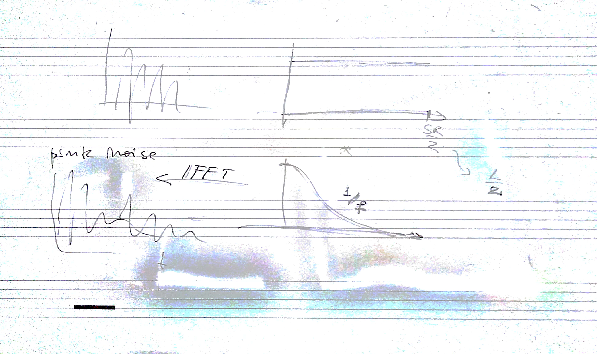

# Seminario di martedì 23 maggio 2018

## Argomenti

* simulazione digitale di:
  * phasing
  * flanging
  * riverbero con rumore gaussiano

## Lavagne



## Codice

[gaussConv.m](./gaussConv.m)

```matlab
```
